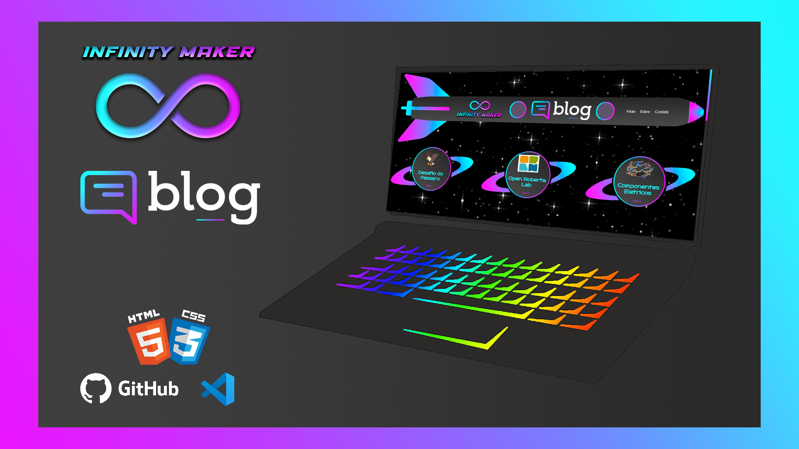

  

## 🖥️ Projeto
Esse é um projeto Web Responsivo de uma Pagina Pricipal de um Blog para exibir assuntos relacionado a Robótica.

## 🚀 Tecnologias
Esse projeto foi desenvolvido por Kauã Melchior com as seguintes tecnologias:

- HTML
- CSS
- Git e Github

## 🏷️ Site
Você pode visualizar o Site através 
[desse link](https://infinity-maker-blog.web.app/). 
